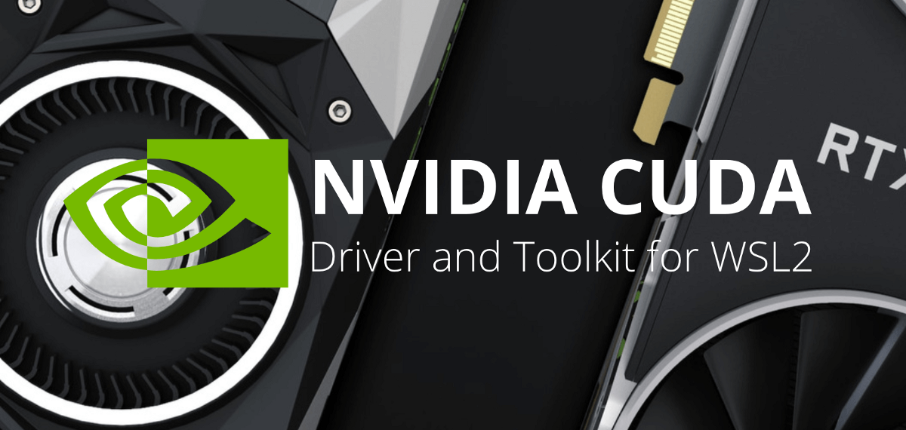

# Covid-Detection-with-VitisAI-and-TensorRT

>Repository for the Embeeded Systems II.

---
**authors:**  

Cristian Conchari  

Franklin Ticona  

Hamed Quenta  

Sergio Fernandez  

<b>date:</b> June 3th 2021

---
  

<h2 style="background-color:tomato;font-size: 15px;">Introduction</h2>

<h2 style="background-color:tomato;font-size: 15px;">Tools</h2>
### **Vitis - AI**

The Vitis™ AI development environment is Xilinx's development platform for AI inference on Xilinx hardware platforms, including both edge devices and Alveo™ cards. It consists of optimized IP, tools, libraries, models, and example designs.

### **Cuda - RT**

Ray tracing, which has long been used for non-real-time rendering, provides realistic lighting by simulating the physical behavior of light. Ray tracing calculates the color of pixels by tracing the path that light would take if it were to travel from the eye of the viewer through the virtual 3D scene.

### **Tensorflow**

TensorFlow is an open-source library developed by Google primarily for deep learning applications. It also supports traditional machine learning. TensorFlow was originally developed for large numerical computations without keeping deep learning in mind.

### **Docker**

Docker is an open platform for developing, shipping, and running applications. Docker enables you to separate your applications from your infrastructure so you can deliver software quickly. With Docker, you can manage your infrastructure in the same ways you manage your applications.

<h2 style="background-color:tomato;font-size: 15px;">Results</h2>